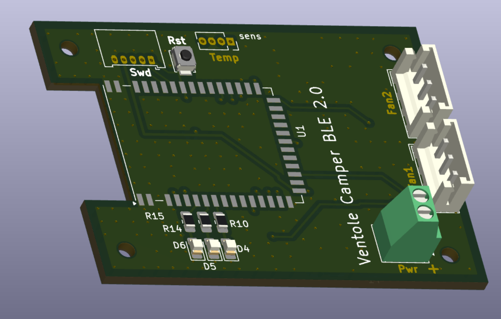
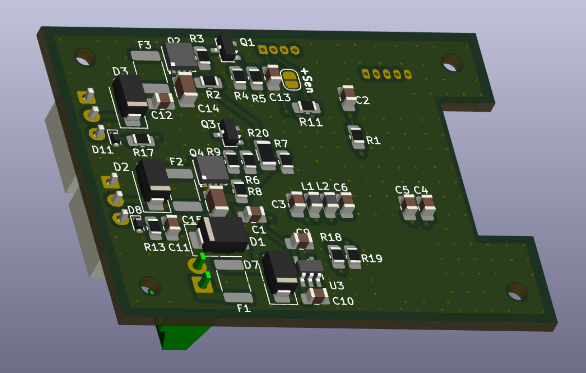
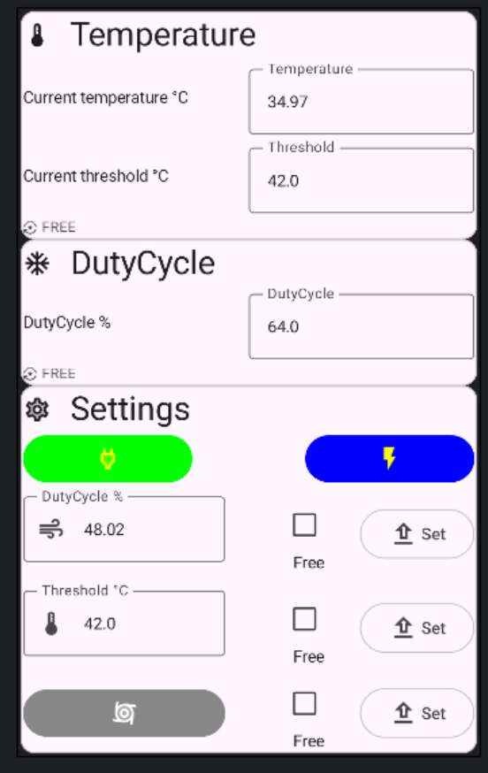
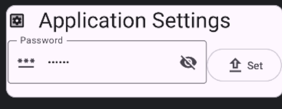

# Introduzione
In estate il frigo trivalente soffre molto a causa delle alte temperature che non consentono un scambio termico adeguato della serpentina di raffreddamente.
In commercio esistono soluzioni ma queste sono pienamente soddisfacenti.
Così ho deciso di realizzare una soluzione che permetesse di:
- regolare la velocità delle ventole in base alla temperature del vano;
- monitorare e controllare da remoto lo stato della board;
- la seconda ventola, sen non forzata da applicativo, viene attivata quando la prima supera la soglia del 70% di utilizzo così da ridurre la rumorosità;
- non pesare sui consumi elettrici quando non necessario.

La cartella "pheripheral_frigo" contiene il progetto per "Visual studio Code" del firmware della board di gestione delle ventole.
La cartella hardware contiene il progetto in Kicad 9 e i file gerber della scheda di controllo.
"AndroidApp" contiene l'applicativo Android di gestione della board.
Ci si riferisca al file README.md interno a ciascuna cartella per dettagli specifici.

# BOARD
Attualmente la revisione del pcb è la 2.0 in cui è stato aggiunto il supporto per il sensore tachimetrico per ciascuna ventola e la possibilità di valutare la tensione della batteria. Al fine di mantenere i consumi bassi si è scelto di inserire il partitore di tensione sotto il mosfet di controllo della ventola1. Questa scelta, benchè renda più semplice il pcb, complica la parte software che è ancora in fase di sviluppo. Probabilmente verrà sostituta aggiungendo un ulteriore switch.

# SOFTWARE GESTIONE
Basato sull'esempio "NRF Blinky" della nordic semiconductor è stato customizzato aggiungendo le funzionalità di riservatezza e di gestione della board.

La [pagina di gestione](AndroidApp/images/app1.png) consente di vedere lo stato corrente ed, eventualmente, di forzarlo. 

Nella [pagina di settings](AndroidApp/images/App2.png ) si può cambiare la password che avrà valore transitorio fino al nuovo reset della scheda o tramite il ciclo power-off -> power-on o attraverso la pressione del tasto di reset. 